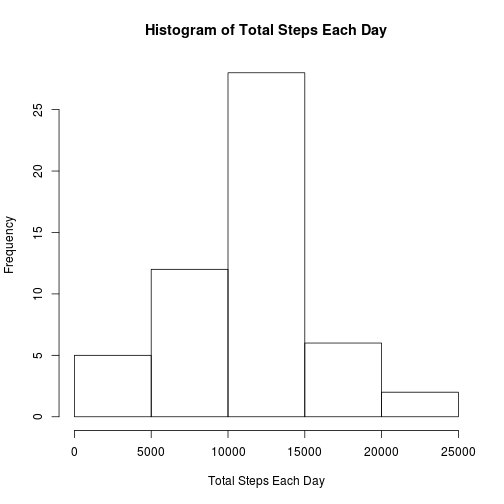
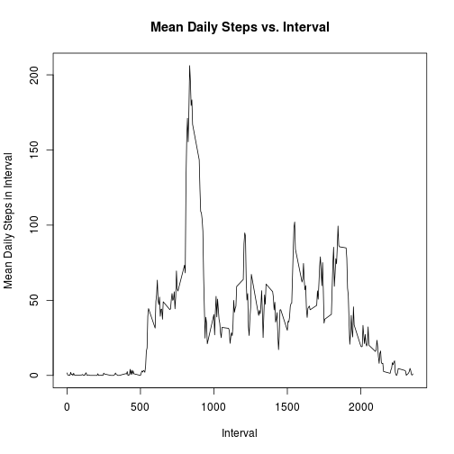
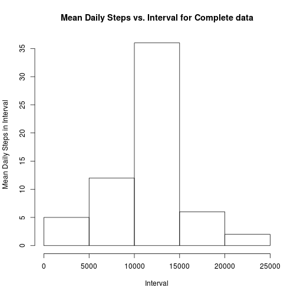
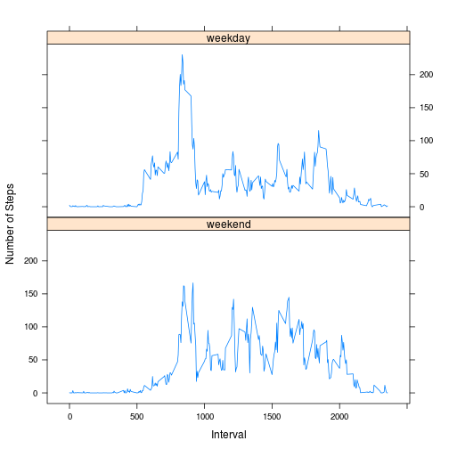

## Loading and preprocessing the data

Read in the data to the data frame 'amd' and set the class of the columns accordingly. Convert the date to character, then use the strptime function to convert it to a POSIXlt data type.

```r
amd<-read.csv('activity.csv',colClass=c('numeric','character','numeric'))

amd$date<-strptime(amd$date,format='%Y-%m-%d')
```


## What is mean total number of steps taken per day?


```r
#find how many days there are and store in all.days
all.days<-unique(amd$date)

#initialize variable to hold how many steps there are each day to 0
steps.each.day=rep(0,length(all.days))

#loop through each day and perform a sum
for (i in 1:length(all.days)){
    #subset the steps data so that the date matches a specific day (all.days[i]) 
    day.subset<-amd$steps[amd$date==all.days[i]]
    #sum over all in that subset to get the total for that day
    steps.each.day[i]<-sum(day.subset)
}
```

Generate a histogram of the total number of steps each day.

```r
hist(steps.each.day,
     xlab = 'Total Steps Each Day', main='Histogram of Total Steps Each Day') 
```

 

Calculate the mean and median values for the total steps each day, omitting 
any values that are NA.

```r
mean.daily<-mean(steps.each.day,na.rm=T)

median.daily<-median(steps.each.day,na.rm=T)
```
The daily median is 1.0765 &times; 10<sup>4</sup>. The daily mean is 1.0766189 &times; 10<sup>4</sup>.

## What is the average daily activity pattern?
Find the daily activity pattern by calculating the mean for each interval.

```r
#find how many intervals there are and store in all.intervals
all.intervals<-unique(amd$interval)

#initialize variable to hold how many intervals there are to NA
steps.each.interval=rep(NA,length(all.intervals))

for (i in 1:length(all.intervals)){
    #subset the steps column for values that have match the current interval
    interv.subset<-amd[amd$interval==all.intervals[i],'steps']
    #take the mean of the current interval, ignoring NA values
    steps.each.interval[i]<-mean(interv.subset,na.rm=T)
}
```

Plot of the time activity pattern for the mean daily steps in an interval vs. 
the interval.

```r
plot(x=all.intervals,y=steps.each.interval,type='l',
     xlab = 'Interval', ylab='Mean Daily Steps in Interval',
     main='Mean Daily Steps vs. Interval') 
```

 

Calculation of location of the interval that contains the maximum.

```r
#finds the value of the max interval
max.interval<-max(steps.each.interval,na.rm=T)
#returns the actual interval 
max.interval.number<-all.intervals[steps.each.interval==max.interval]
```
The interval that contains a maximum value of 206.1698113 is interval 
835.

## Imputing missing values
Calculate how many NA values are found in the data set.

```r
no.of.missing.values<-sum(is.na(amd$steps))
```
The number of missing values in the data frame is 2304.

Copy the data frame to a new data frame that will have all NA values replaced with the values obtained from the previous daily mean for each interval.

```r
amd.c<-amd

for (i in 1:length(amd.c[,1])){
    # checks to see if the value is NA
    if(is.na(amd.c[i,1])){
        # creates logic vector to determine the location of the current interval
        # value in the the all.intervals vector
        interv.logi.v<-all.intervals==amd.c[i,3]
        # using above logic vector, puts the previously found mean steps for 
        # that interval into the location that was previously NA
        amd.c[i,1]<-steps.each.interval[interv.logi.v]
    }
}
```

Repeat the process used above to create a data set that is averaged over each 
interval from the newly created complete data set.


```r
#initialize variable to hold how many intervals there are to 0
steps.each.day.c=rep(0,length(all.days))

for (i in 1:length(all.days)){
    #subset the steps data so that the date matches a specific day (all.days[i]) 
    day.subset<-amd.c$steps[amd.c$date==all.days[i]]
    #sum over all in that subset to get the total for that day   
    steps.each.day.c[i]<-sum(day.subset)
}
```

Creates a histogram of mean daily steps vs interval using the complete data set.

```r
hist(steps.each.day.c,xlab = 'Interval', ylab='Mean Daily Steps in Interval',
     main='Mean Daily Steps vs. Interval for Complete data')
```

 

Calculates the mean and median of the new complete data sets

```r
mean.s.e.d.c<-mean(steps.each.day.c)

median.s.e.d.c<-median(steps.each.day.c)
```

With the completed data sets, the new mean is 1.0766189 &times; 10<sup>4</sup> and the new 
median is 1.0766189 &times; 10<sup>4</sup>. The mean is exactly the same, but the mean is 
slightly different. This is not surprsing since I used the average values to 
replace NA values. The mean should be the same, and the medain can be different 
because there are a greater number of entries in the dataset. It is expected for 
the median to be close to what it previously was, and it is in this case.

## Are there differences in activity patterns between weekdays and weekends?

Create a new factor variable and add it to the previously created 
complete data set.

```r
#logic vector for weekends
amd.c$week.end.day<-weekdays(amd.c$date)=='Saturday'|weekdays(amd.c$date)=='Sunday'
#convert to a factor
amd.c$week.end.day<-factor(amd.c$week.end.day,labels=c('weekday','weekend'))
```


Repeat process used to find the mean steps per interval but keep the weekend 
and weekday data in separate variables.

```r
all.intervals<-unique(amd.c$interval)

#initialize each interval to 0
steps.each.interval.d=rep(0,length(all.intervals))
steps.each.interval.e=rep(0,length(all.intervals))


for (i in 1:length(all.intervals)){
    # create logic vector to subset over which matches both the correct
    # interval and is a weekday
    logi.v.d<-amd.c$interval==all.intervals[i] & amd.c$week.end.day=='weekday'
    #take mean of steps for matching subset 
    steps.each.interval.d[i]<-mean(amd.c[logi.v.d,'steps'])
    
    # create logic vector to subset over which matches both the correct
    # interval and is a weekend
    logi.v.e<-amd.c$interval==all.intervals[i] & amd.c$week.end.day=='weekend'
    #take mean of steps for matching subset 
    steps.each.interval.e[i]<-mean(amd.c[logi.v.e,'steps'])
}
```

Below is code to process the newly obtained data to create a single data frame.
This will make plotting the comparison of the weekday and weekend activity
easier.

```r
#create data frame for weekend data
w.e<-data.frame(all.intervals,steps.each.interval.e,'weekend')
# rename columns
colnames(w.e)<-c('interval','steps','activity.day')

#create data frame for weekday data
w.d<-data.frame(all.intervals,steps.each.interval.d,'weekday')
# rename columns
colnames(w.d)<-c('interval','steps','activity.day')

#bind the weekend and weekday data frames together
activity.avg<-rbind(w.e,w.d)
```

Create a plot that shows mean steps vs interval that compares the weekend 
and weekday activity

```r
library(lattice)

xyplot(steps ~ interval | activity.day, data = activity.avg, 
       layout = c(1, 2), type='l',ylab='Number of Steps',xlab='Interval')
```

 

